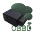

# Gobbed
 Gobbed is [Free Software](COPYING.md) for connecting to your vehicle's data buses.

## Design

Gobbed began life as a bash script for Mac OS X to talk to almost any Bluetooth ELM327 adapter out there. After thinking about it, Gobbed is now available as an Android app that displays a WebView.

**Android OS (bluetooth stack) > Native app with HTML+JS baked into it > WebView**

The longer explanation with bash script is [here](https://github.com/davidhubbard/gobbed/wiki).

## Quick Download

Google Play Store link

## Hacking

I write using Android Studio. It won't be too hard to test building the project with Eclipse, once I have time.

1. `git clone https://github.com/davidhubbard/gobbed.git`
2. Open the project in Android Studio and choose Run menu > Run 'app'
3. If it runs ok on your device then you are ready to hack on the code.
4. Go to (TBD source dir) and take a look at (TBD source file). This sets up the main UI.

## Copyright

Gobbed Copyright (c) David Hubbard 2016. Licensed under the [GPLv3](COPYING.md). Please see the [COPYING.md](COPYING.md) file in this directory.